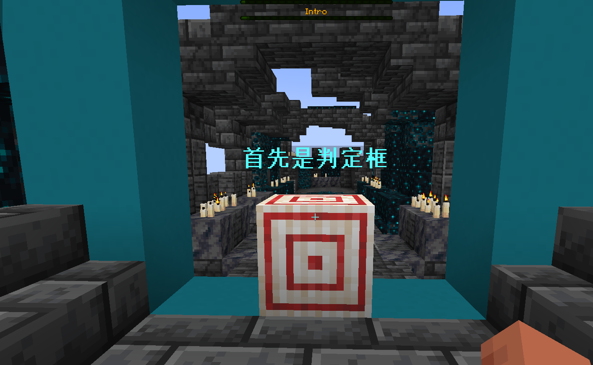

# 基本概念&FAQ

## 必修

在开始制作自己的谱面之前，你需要了解这些概念： 
- **游戏刻**:  也就是Tick,表示游戏循环的一个周期。在Minecraft中,  游戏会固定在每秒20Tick的速度运行，这也是TPS(Tick Per Second)的概念。RhythMC也遵循本特性，一秒运行20个Tick。每个Tick游戏将会进行一次判定，和一次帧生成。
- **Notes** :  代表一个音符。Notes一共有五种。你可以在[这里]("link")找到。
- **帧**: 代表了一个刻中会判定的的所有Notes与特效。
- **特效**: 谱面特效，给予你的谱面酷炫的效果
- **轴**: 代表相对y坐标。取值范围从2到-1。
- **谱面资源包**: 允许玩家听到美丽音乐的材质包。由替换ENTITY_HORSE_DEATH实现
- **编辑资源包**: 允许谱师听到美丽的歌曲。由替换ENTITY_IRONGOLEM_DEATH实现
以及RhythMC基本的玩法  

## 中心点
中心点指的是判定框上的一个点。Note和特效的位置都是由中心点决定的。  

## 编辑器原理

RhythMC的谱面编辑器是纯基于原版Minecraft实现的，不需要添加任何Mod或数据包。  
一首曲子将会被分成若干个15s的小块(Chunk),以方便各位谱师不用每次都从头开始播放。  
*为什么要分块呢？因为Minecraft不能从中间开始播放音乐= =*  
每个小块都对应着一个编辑器材质包。*暴力\*方便\*直接\*  
这样就可以对一个段落进行微调了。

## FAQ

你问我先
提问通道: +我Q

## 更新日志

**2024/3/31(b-203)** 编辑器制作完成  