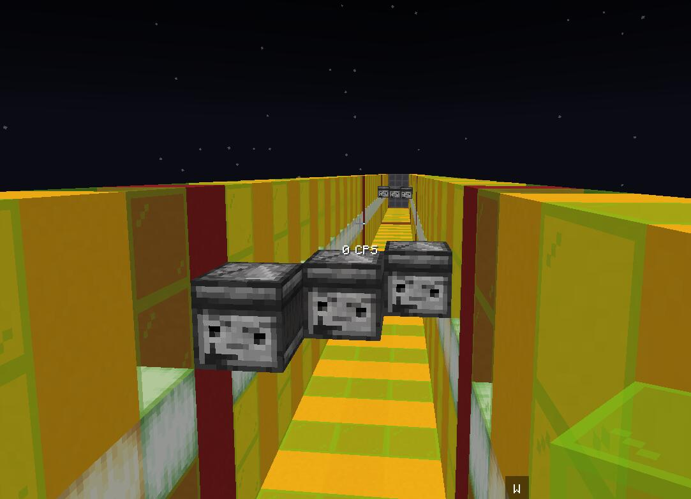
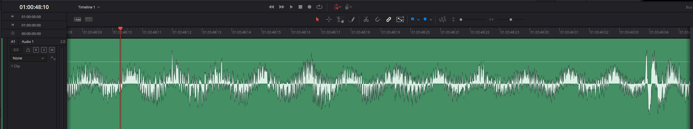
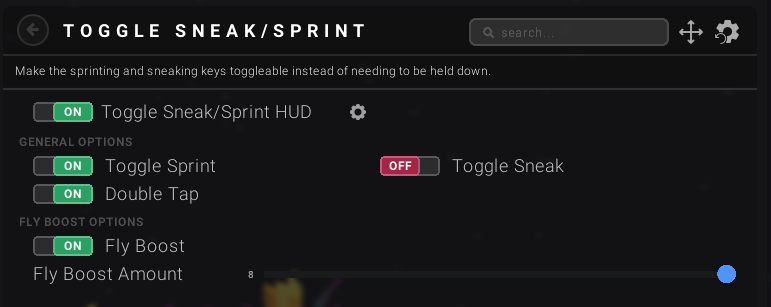
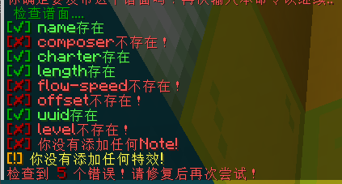

# 开始制谱吧!

## 准备工作

在开始自己的奇妙创作之前，你需要首先准备以下几种东西:
- **编辑器使用权限(请+我q申请)**
- 歌曲源文件 (mp3/flac) ogg可能不太行。
- 曲师的歌曲使用许可
- 曲绘，制作材质包时使用
- 事先计算好的歌曲Tick长度  **计算公式: 歌曲长度(秒) * 20**
- 一个有耐心的性子

## 1. 找Frk制作材质包

  

**注意** 这只是一个**示例**

将你的曲子，曲名，曲师名 发送给Frk。
Frk将会帮你制作好材质包。

自助将会过亿会在做()

## 2. 创建谱面文件

进入游戏,打开聊天框,
输入指令:`/editor create <歌曲名> <曲师> <长度>`以创建一个新的谱面

*参数说明*  
歌曲名 请输入你给Frk歌曲名 要不然做不出来。  
曲师 请填曲师名字    
长度 请填上面计算的歌曲Tick长度。  

:::danger[注意]

请务必务必确保 **歌曲名** 以及 **长度** 的大小是对的。否则可能会导致致命问题，如谱面无法编辑, 保存失败，无法读取..

:::

## 3. 开始编辑！
<!-- 你可以看到，目前你已经是创造模式了。   -->
编辑器是一个长300Block，宽5Block, 高5Block的区域。  

每20格会有一个红色混凝土区分。一个区间为1秒(20Tick)。总共能一次性编辑15s的内容。  
从背包里拿出`铁块`、`红石块`、`钻石块`、`观察者`以及`TNT`，并把他们分别放置在对应的位子上，就可以了。  

由于MC特性限制，你可能需要额外的显示音频波形的软件帮助你...  
比如说：DaVinCi Resolve  

:::danger[注意]
钻石块只允许出现在-1轴。  
:::

:::tip[Tips]
你可以放置任何方块辅助你。这些方块将不会被记录在谱面内。  
觉得300格太远了？ 试试这个。

:::

### 更换Chunck
当你结束了一个chunck的修改工作，你可以使用`/editor edit <新chunck>` 来保存当前Chunck并开启新的Chunck编辑  

### 保存谱面
使用`/rhymc save`来保存谱面。  
注意：谱面只能由你一人编辑！  

### 播放谱面
在谱面的任何时候都可以使用 `/editor play` 来试运行谱面。  
在计分板上你可以看到当前的谱面Tick数，以方便调试  

### 谱面特效
RhythMC自带6种特效。  
如何创建他们请看左侧特效栏。  

## 发布谱面
终于把谱子写好了。  
只需要一行命令，RhythMC会自动帮你把谱面移动到审核区。  
审核完成即可上架啦！  
`/editor finish`   
输入两遍以确认。  
  
RhythMC会自动检查谱面信息。  
按照提示修改即可。  

## 生活小妙招
1. 制作谱面时，如果你想要计算长度(比如说Hologram该持续多久) 你可以直接在聊天框打出表达式，RhythMC会帮你计算
2. 如果你不会使用制谱器，你可以问问Frk(不要问太若只的问题 歇歇)
3. 有时候直接编辑谱面Json文件可能更好。你可以找Frk要。