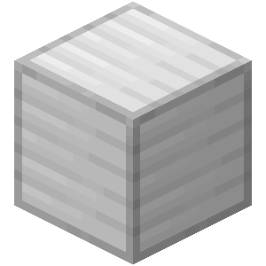

# NoteRightClick
右键



默认材质: `Material.IRON_BLOCK`

这个Note需要你右键它以将它击碎。

## 谱面格式
```json
    {
        "type":"NOTE_RIGHT_CLICK",
        "pos":[
            -1,
            1
        ]
    }
```
type : 类型
pos : 相对位置

## 创建方式

编辑器放置方块
