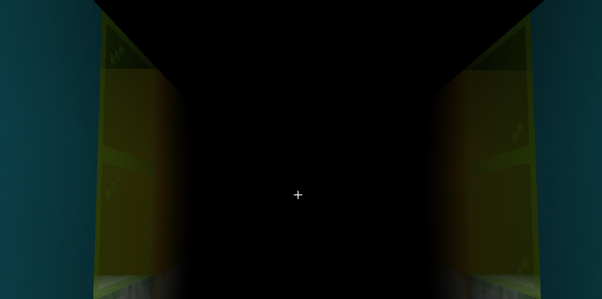

# 反转


玩家屏幕变黑。

## 谱面格式
```json
    {
        "effect-type":"INVERT",
        "start-tick":10,
        "duration":100
    }
```
start-tick : 开始时间(tick)  
duration : 持续时间(tick)

## 创建方式

### 命令

`/editor effects invert <开始tick> <持续tick>`  
**参数&lt;开始tick>** : 整数，表示开始时间的绝对tick.  
**参数&lt;持续tick>** : 整数，表示持续时间的长度(tick)