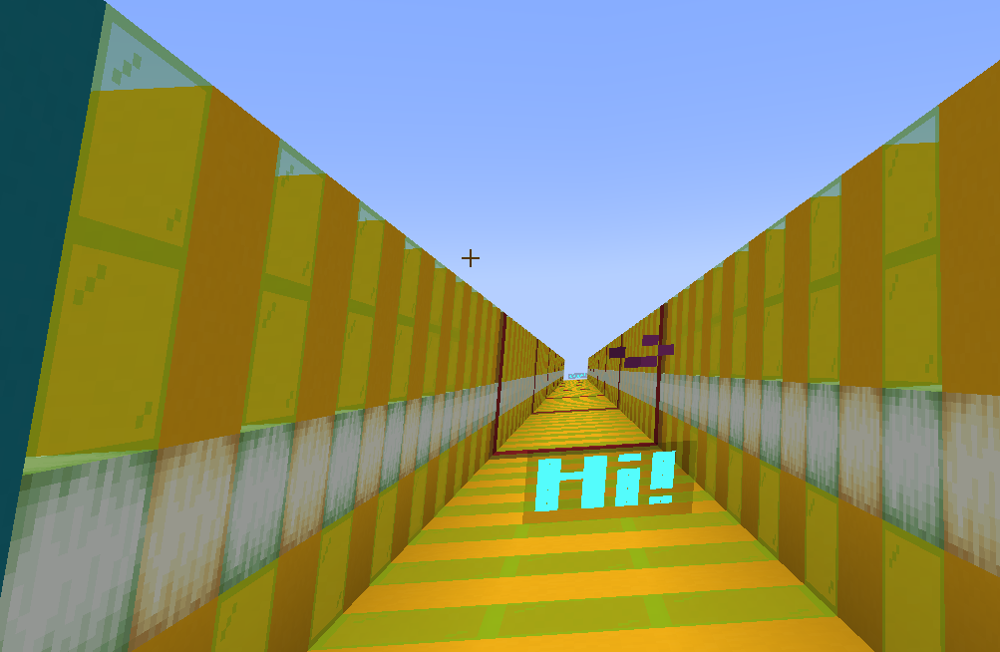

# 效果


给予玩家一个效果

## 谱面格式
```json
    {
        "effect-type":"EFFECT",
        "start-tick":10,
        "effect-id":"NAUSEA",
        "duration":100
    }
```
start-tick : 开始时间(tick)  
duration : 持续时间(tick)  
effect-id : 特效的MinecraftID

## 创建方式

### 命令

`/editor effects effect <开始tick> <持续tick> <特效ID>`  
**参数&lt;开始tick>** : 整数，表示开始时间的绝对tick.  
**参数&lt;持续tick>** : 整数，表示持续时间的长度(tick)
**参数&lt;特效ID>** : 字符串，代表特效的MinecraftID。你可以在MinecraftWiki找到各个效果对应的MinecraftID
