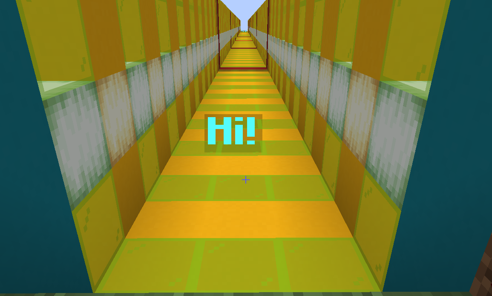
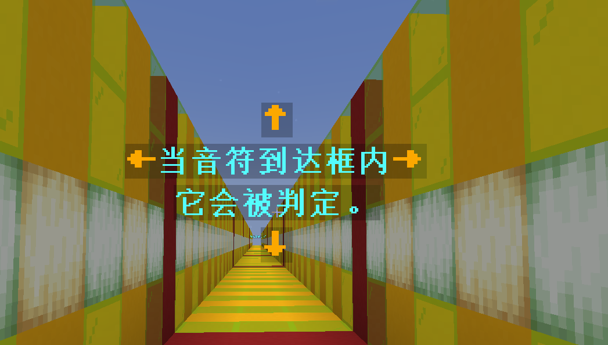

# 全息图


在判定框上显示一个Hologram.

## 谱面格式
```json
    {
        "effect-type":"HOLOGRAM",
        "start-tick":0,
        "duration":36,
        "hologram-loc":[
            0,
            1,
            0
        ],
        "hologram-contents":[
            "&b&lHi!"
        ]
    }
```
start-tick : 开始时间(tick)  
duration : 持续时间(tick)  
hologram-loc : [相对x坐标,相对y坐标]
hologram-contents: [内容]
## 创建方式

### 命令

`/editor effects hologram <开始tick> <持续tick> <相对x> <相对y> <相对z> <内容>`  
**参数&lt;开始tick>** : 整数，表示开始时间的绝对tick.  
**参数&lt;持续tick>** : 整数，表示持续时间的长度(tick)  
**参数&lt;相对x>** : 小数，表示与中心点的相对x坐标  
**参数&lt;相对y>** : 小数，表示与中心点的相对y坐标  
**参数&lt;相对z>** : 小数，表示与中心点的相对z坐标
**参数&lt;内容>** : 可变数组，表示内容。支持`PlaceholderAPI`以及`&`颜色代码

*没看懂? 举个例子吧！*

假设你想创建这样的hologram  
你应该输入以下命令:  
`/editor effects hologram <开始tick> <持续tick> 0 1.5 &6&l↑ &6&l←&b&l当音符到达框内&6&l→ &b&l它会被判定。 &6&l↓`
每行之间使用空格分开即可。  