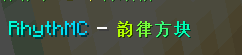

# 消息

  
在聊天框中显示一条消息。

## 谱面格式
```json
    {
        "effect-type":"MESSAGE",
        "start-tick":0,
        "contents":[
            "&bHello!"
        ]
    }
```
start-tick : 开始时间(tick)  
contents: [内容]

## 创建方式

### 命令

`/editor effects message <开始tick> <内容>`  
**参数&lt;开始tick>** : 整数，表示开始时间的绝对tick.  
**参数&lt;内容>** : 可变数组，表示内容。支持`PlaceholderAPI`以及`&`颜色代码  
大致上跟Hologram差不多，只是位置变成了聊天框。  
