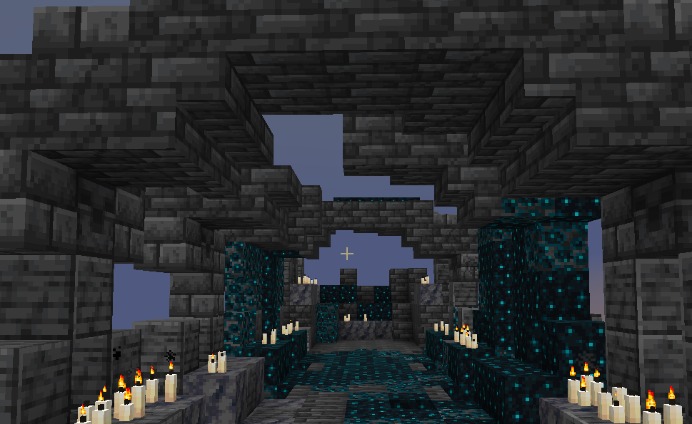

# 更改时间


更改玩家的客户端时间

## 谱面格式
```json
    {
        "effect-type":"TIME",
        "start-tick":10,
        "time":100
    }
```
start-tick : 开始时间(tick)  
duration : 持续时间(tick)  
time : 时间 in Ticks

## 创建方式

### 命令

`/editor effects invert <开始tick> <时间>`  
**参数&lt;开始tick>** : 整数，表示开始时间的绝对tick.  
**参数&lt;时间>** : 整数，更改到的客户端时间 in tick